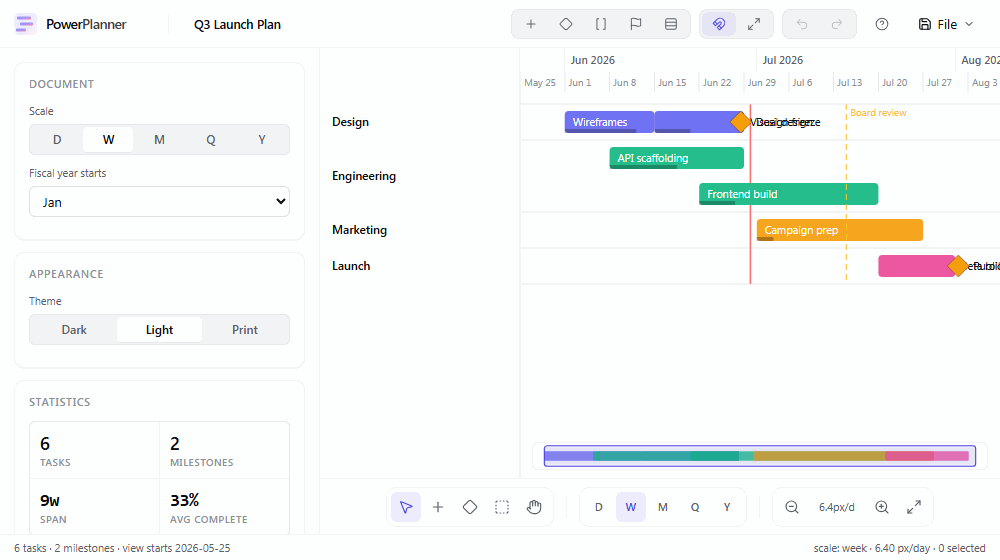
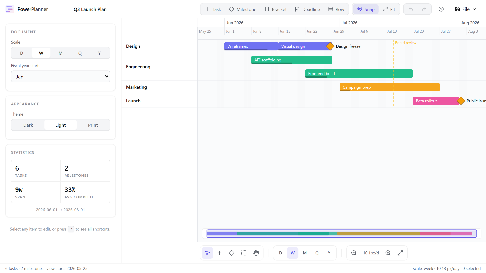
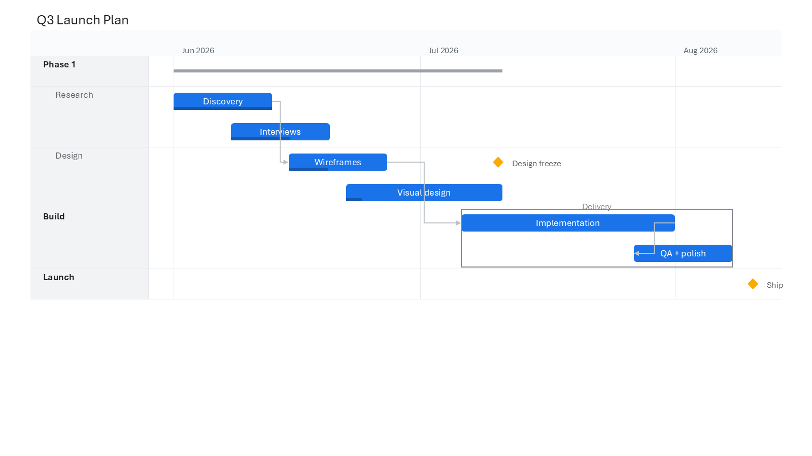
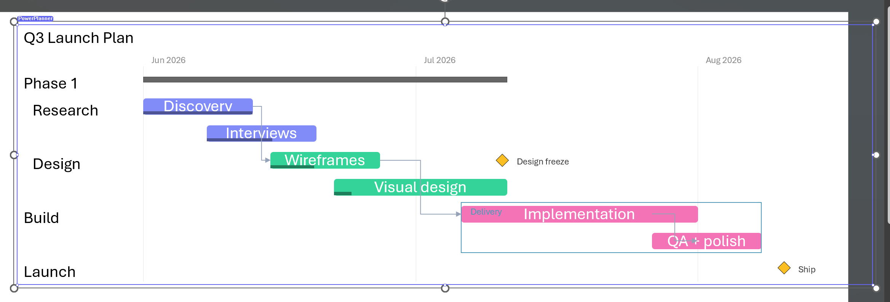
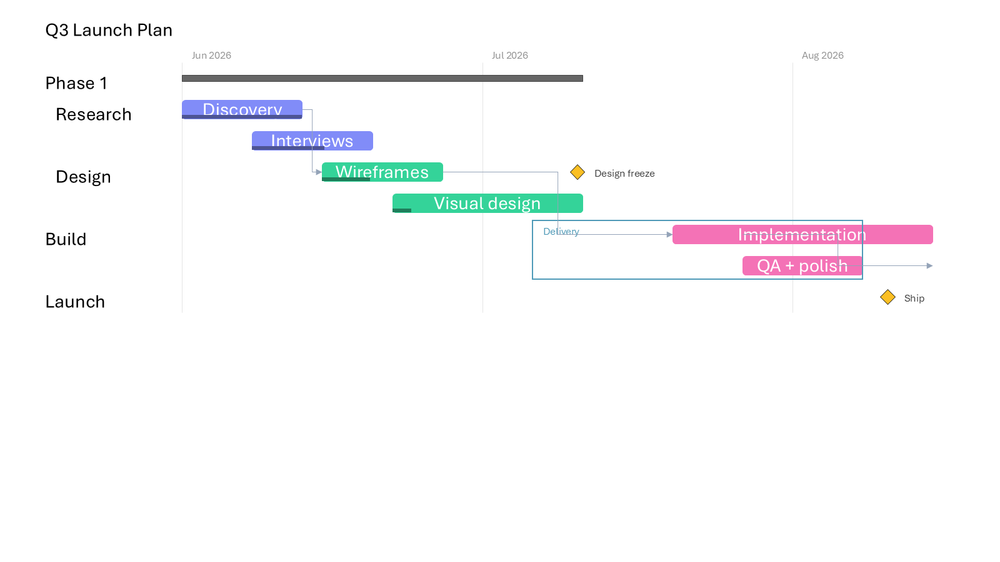

# PowerPlanner

**Calendar-true Gantt charts you can actually present.**

PowerPlanner is a presentation-grade Gantt chart authoring tool — task bars, milestones, brackets, dependency arrows, critical path highlighting, baseline drift tracking, today line, percent-complete fills — with every element directly editable by dragging, typing, or via a Linear-style Cmd+K command palette.

It ships as a **single-file portable HTML app** — no install, no account, no server. Open the file in any modern browser and start planning. Press <kbd>Ctrl+S</kbd> to save; your chart is embedded back into the same HTML file.

## Gallery

### Web app



*The single-file web app, switching time scales (week → month → quarter → year → fit).*



### PowerPoint add-in (native)

A native C++ COM add-in (think-cell style) that emits the chart as **real, editable PowerPoint shapes** — not an image — with a clean Material look:



On-slide contextual overlay (selection frame, handles, and a badge) tracking the selection over the live slide:



Live linkage — drag a bar, hit **Reflow**, and the move is read back into dates with dependencies/summary reflowed and the embedded data kept in sync:



> Build the DLL and test it in PowerPoint on any 64-bit-Office PC — see **[docs/native-addin-install.md](docs/native-addin-install.md)** (prebuilt DLL + `register.bat`, no admin or Visual Studio needed to register).

## Get started

1. Download **`PowerPlanner.html`** from the [latest release](https://github.com/CynaCons/powerplanner/releases/latest).
2. Open it in any browser (Chrome / Edge / Safari / Firefox).
3. Start editing.
4. Press <kbd>Ctrl+S</kbd> to save back to the HTML file.
5. Email or share the file. Recipients get a fully editable copy with no install.

## What's inside

### Direct manipulation
- **Click anywhere with the Task tool (T)** to add a task at that date and row
- **Drag bars** to move dates; drag edges to resize; drag from edge handles to wire dependencies
- **Type dates** in the inspector — the bar moves
- **F2 or double-click** to rename inline
- **Right-click anything** — context menu for everything
- **Marquee select (R)**, multi-select with Shift+click

### Linear-style command palette
- <kbd>⌘K</kbd> (or <kbd>Ctrl+K</kbd>) opens a fuzzy-searchable palette
- Every action available: create, switch tools, change scale, toggle views, switch theme, save, open, all exports, load templates
- Arrow-key navigation, Enter to run

### Templates
Start fast with built-in starters: **Product Launch**, **Two-Week Sprint**, **Hiring Plan**, **Marketing Campaign**, or **Blank**.

### Pro features
- **Critical Path Method** — toggle on to highlight tasks with zero float in red
- **Baselines** — capture a snapshot of your schedule, then visualize drift as you replan
- **Minimap** — compact overview rail at the bottom of the chart; click to pan

### Calendar
- Day / Week / Month / Quarter / Year scales (switch with the bottom toolbar or <kbd>⇧D</kbd>/<kbd>⇧W</kbd>/<kbd>⇧M</kbd>/<kbd>⇧Q</kbd>/<kbd>⇧Y</kbd>)
- Custom fiscal-year start month
- Weekend shading and working-day calendar
- Today line with a TODAY pill label that updates automatically

### Persistence & export
- **Save embedded HTML** — `Ctrl+S` embeds the chart JSON into the file itself
- **Auto-save** to localStorage every second (with a non-blocking restore banner on next launch)
- **Export PNG (1× or 2×), SVG, JSON, YAML**; print to PDF
- **Open** any prior `.html`, `.json`, or `.yaml` via file picker or drag-drop

### Themes
Light by default, with Dark and Print (high-contrast for paper-quality output) available from the theme switcher.

## Keyboard shortcuts

| Key | Action |
|---|---|
| <kbd>⌘K</kbd> / <kbd>Ctrl+K</kbd> | Open command palette |
| <kbd>?</kbd> | Open shortcuts overlay |
| <kbd>V</kbd> / <kbd>T</kbd> / <kbd>Y</kbd> / <kbd>R</kbd> / <kbd>H</kbd> | Select / Task / Milestone / Marquee / Pan tools |
| <kbd>⇧D</kbd>/<kbd>⇧W</kbd>/<kbd>⇧M</kbd>/<kbd>⇧Q</kbd>/<kbd>⇧Y</kbd> | Day / Week / Month / Quarter / Year scale |
| <kbd>N</kbd> / <kbd>M</kbd> / <kbd>B</kbd> | Quick-add task / milestone / bracket |
| <kbd>F2</kbd> / dbl-click | Rename selected task |
| <kbd>←</kbd>/<kbd>→</kbd> | Nudge by 1 day (<kbd>Shift</kbd> = 7 days) |
| <kbd>Del</kbd> | Delete selection |
| <kbd>+</kbd> / <kbd>−</kbd> | Zoom in / out |
| <kbd>Home</kbd> | Fit to data |
| <kbd>S</kbd> | Toggle snap-to-scale |
| <kbd>Esc</kbd> | Clear selection / revert to Select tool |
| <kbd>⌘Z</kbd> / <kbd>⌘⇧Z</kbd> | Undo / Redo |
| <kbd>⌘S</kbd> | Save (embeds chart in HTML) |
| Wheel | Zoom at cursor |
| <kbd>Shift</kbd>+wheel | Pan horizontally |

## How it works

Each PowerPlanner file is a standalone HTML application. When you save, the chart is serialized to JSON and embedded inside a `<script type="application/json" id="powerplanner-data">` tag in the same HTML file. Reopen the file to continue editing. The renderer is pure SVG, so PNG/SVG/PDF exports are crisp at any resolution.

## Roadmap

PowerPlanner is built so the same engine powers multiple surfaces:

- ✅ **Portable HTML** — this release
- 🟡 **Web app** — hosted edition with accounts and sharing
- 🟡 **PowerNote node** — embeddable Gantt node inside [PowerNote](https://github.com/CynaCons/PowerNote)
- 🟡 **PowerPoint add-in** — Office.js task pane that emits native, vector-editable shapes

See [PLAN.md](PLAN.md) for the full roadmap and [PRD.md](PRD.md) for product details.

## Development

```bash
npm install
npm run addin:certs      # Trust the localhost dev certificate (run once per machine)
npm run dev              # Dev server at http://localhost:5180
npm run dev:addin        # HTTPS dev server for PowerPoint sideload (port 5180)
npm run build:template   # Build standalone PowerPlanner.html → dist-template/
npm test                 # Unit tests (vitest)
npm run test:e2e         # Playwright E2E tests
```

Agent guidance for Codex, Claude, and other coding assistants lives in
[AGENTS.md](AGENTS.md). `CLAUDE.md` delegates to the same shared instructions.

## Stack

React 19 + TypeScript + Vite + SVG renderer + Zustand. Single-file build via `vite-plugin-singlefile`. Around **270 KB** total (82 KB gzipped). **38 unit tests + 4 E2E tests**, all passing.

## License

MIT.
